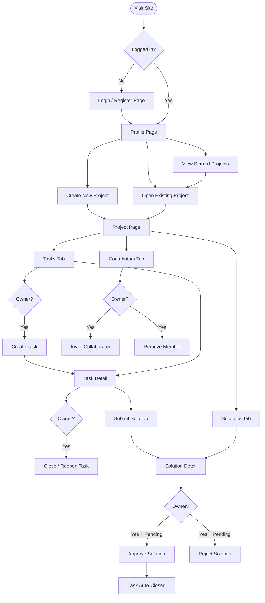

# TaskSpace

## Description

Inspired by both the collaborative potential of Github's repository formats and the organizational nature of Trello's boards but desiring something more stripped-down and less code-oriented that combines the two: I present TaskSpace, a website for organizing all the necessary to-do's and proposed action items of any collaborative project.

It starts out with a login/account creation page where users do one of the two things so that whatever they do in the site can be saved and associated with their account. Then, once a user is logged in, they are greeted with a page of their account, which shows things like their profile picture, a list of created projects, and a heatmap showing account activity through time. The user also has a button to create a new project, in which case they will need to provide a title and description. When a user clicks on a project, they are taken to the project page, where they can see the aforementioned title and description along with a list of contributors/collaborators.

Alongside that are tabs for the Tasks and Solutions, the former featuring a list of tasks—with each task featuring a title, description, and list of assigned collaborator(s)—and the latter will featuring a list of solutions that will always be associated to a task. A task can have multiple solutions, in which case one will have to be chosen as the "working solution".  Once a solution is approved, the task associated with it will be closed (unless the user decides to reopen it later for whatever reason). Solutions can also potentially have files attached to them if need be—such as if a project requires a logo and different contributors offer different logos with one needing to be chosen—but these will only be for the other contributors to access by themselves instead of being put in a "repository".

When one clicks on the list of contributors/collaborators on the main page of the project, it shows a hierarchy of who has contributed the most, with bar graphs for each showing contributions per day/week. This allows for the data to be visualized. (Note: one task, one solution, and one editing of the project title/description each count as one contribution).

### Tech Stack

This website is built upon the Express.js framework with handelbars.js for individual page templating, Sqlite3 for all database needs, Chart.js for plot displays, and Multer for file attachment. The site is deployed on render.com

## Wireframes

### Login / Register

```
┌──────────────────────────────────────────┐
│  ✦ TaskSpace                             │
├──────────────────────────────────────────┤
│                                          │
│          ┌────────────────────┐          │
│          │  Sign In           │          │
│          │                    │          │
│          │  Username          │          │
│          │  ┌──────────────┐  │          │
│          │  └──────────────┘  │          │
│          │  Password          │          │
│          │  ┌──────────────┐  │          │
│          │  └──────────────┘  │          │
│          │                    │          │
│          │  [   Sign In   ]   │          │
│          │                    │          │
│          │  No account?       │          │
│          │  Create one here   │          │
│          └────────────────────┘          │
│                                          │
└──────────────────────────────────────────┘
```

*(The Register page mirrors this layout with Username, Password, and Confirm Password fields.)*

---

### Profile Page

```
┌────────────────────────────────────────────────────────┐
│  ✦ TaskSpace        [ Search… ]             [ A  ▾ ]   │ ← avatar dropdown
├────────────────────────────────────────────────────────┤
│  ┌────────┐  Username                                  │
│  │   A    │                                            │
│  └────────┘  Bio text (optional)                       │
│              Joined Jan 1, 2025                        │
│              ┌────────┐  ┌──────────────┐  ┌───────┐   │
│              │   3    │  │     24       │  │   5   │   │
│              │Projects│  │Contributions │  │ Stars │   │
│              └────────┘  └──────────────┘  └───────┘   │
├──────────────┬─────────────────┬───────────────────────┤
│   Overview   │    Projects     │       Stars           │
├──────────────┴─────────────────┴───────────────────────┤
│  Created Projects                                      │
│  ┌──────────────────┐  ┌──────────────────┐            │
│  │  Project Alpha   │  │  Project Beta    │            │
│  │  Description…    │  │  Description…    │            │
│  │  2 contributors  │  │  4 contributors  │            │
│  └──────────────────┘  └──────────────────┘            │
│                                                        │
│  Activity (last year)             24 contributions     │
│  ┌────────────────────────────────────────────────┐    │
│  │ · · · ▒ · · · ▓ · · ▒ · · · · ▓ ▓ · · ▒ · · ·  │    │ ← heatmap grid
│  │ · · · · · · · · · · · ▒ · · · · · · ▓ · · · ·  │    │
│  │ · ▒ · · · · ▒ · · · · · · · ▒ ▒ · · · · · · ·  │    │
│  └────────────────────────────────────────────────┘    │
│                                        Less ░▒▓■ More  │
└────────────────────────────────────────────────────────┘
```

---

### Project Page

```
┌────────────────────────────────────────────────────────┐
│  ✦ TaskSpace        [ Search… ]             [ A  ▾ ]   │
├────────────────────────────────────────────────────────┤
│  ✦  Project Alpha              [★ Star] [Edit] [Delete]│
│     Owned by username · Created Jan 1, 2025            │
│     Project description text…                          │
│                                                        │
│     3 contributors  ·  2 open tasks  ·  5 solutions    │
├──────────────────┬──────────────────┬──────────────────┤
│   Tasks  (4)     │  Solutions  (5)  │ Contributors (3) │
├──────────────────┴──────────────────┴──────────────────┤
│  [ All (4) ] [ Open (2) ] [ Closed (2) ]  [+ New Task] │
│  ┌──────────────────────────────────────────────────┐  │
│  │ ● Task One                             [Open]  A │  │
│  │   #1 · opened Jan 5 by username · 2 solutions    │  │
│  ├──────────────────────────────────────────────────┤  │
│  │ ○ Task Two                           [Closed]    │  │
│  │   #2 · opened Jan 6 by username · 1 solution     │  │
│  └──────────────────────────────────────────────────┘  │
└────────────────────────────────────────────────────────┘
```

*(The Solutions tab shows the same toolbar pattern with All / Pending / Approved filters. The Contributors tab shows a ranked list with proportional bar graphs and per-member activity charts.)*

---

### Task Detail

```
┌────────────────────────────────────────────────────────┐
│  ✦ TaskSpace        [ Search… ]             [ A  ▾ ]   │
├────────────────────────────────────────────────────────┤
│  Profile / Project Alpha / #1                          │
│                                                        │
│  Fix the header layout               [Open]            │
│  Task #1 · opened Jan 5, 2025 by username              │
│  ┌──────────────────────────────────┐  ┌────────────┐  │
│  │ username described this task     │  │ Assignees  │  │
│  │                                  │  │  ┌──┐ ┌──┐ │  │
│  │ Task description text…           │  │  │A │ │B │ │  │
│  │                                  │  │  └──┘ └──┘ │  │
│  └──────────────────────────────────┘  ├────────────┤  │
│                                        │ Status     │  │
│  Solutions (2)                         │ [Open]     │  │
│  ┌──────────────────────────────────┐  ├────────────┤  │
│  │ ◈ Solution A       [Pending]     │  │ Project    │  │
│  │ ◈ Solution B       [Approved]    │  │ Alpha      │  │
│  └──────────────────────────────────┘  └────────────┘  │
│                                                        │
│  [Submit a Solution]          [Close Task / Reopen]    │
└────────────────────────────────────────────────────────┘
```

---

### Solution Detail

```
┌────────────────────────────────────────────────────────┐
│  ✦ TaskSpace        [ Search… ]             [ A  ▾ ]   │
├────────────────────────────────────────────────────────┤
│  Profile / Project Alpha / Solutions / #3              │
│                                                        │
│  Logo Concept A — Geometric Mark         [Pending]     │
│  Solution #3 · submitted Jan 8 by username             │
│  for task #1 — Fix the header layout                   │
│  ┌──────────────────────────────────┐  ┌────────────┐  │
│  │ username described this solution │  │Submitted By│  │
│  │                                  │  │  ┌──┐      │  │
│  │ Solution description text…       │  │  │A │ user │  │
│  │                                  │  │  └──┘      │  │
│  └──────────────────────────────────┘  ├────────────┤  │
│                                        │Linked Task │  │
│  Attachments (2)                       │ #1 — Fix…  │  │
│  ┌──────────────────────────────────┐  │ [Open]     │  │
│  │ [IMG] logo-v1.png       24.1 KB  │  ├────────────┤  │
│  │ [PDF] brief.pdf        102.4 KB  │  │ Status     │  │
│  └──────────────────────────────────┘  │ [Pending]  │  │
│                                        └────────────┘  │
│  ┌────────────────────────────────────────────────┐    │
│  │ Approving closes task #1.                      │    │
│  │ [✓ Approve]  [✕ Reject]                        │    │
│  └────────────────────────────────────────────────┘    │
└────────────────────────────────────────────────────────┘
```

---

## User Flow


